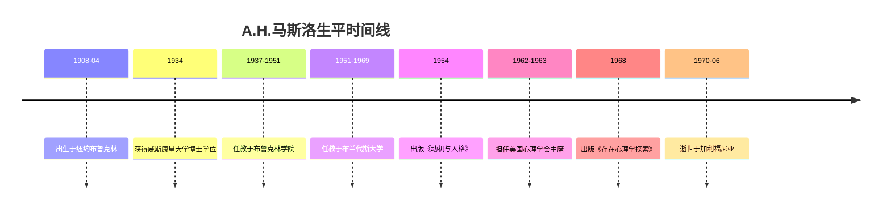

# A.H.马斯洛

## 概述
> 亚伯拉罕·哈罗德·马斯洛（Abraham Harold Maslow, 1908-1970），美国心理学家，[[人本主义心理学]]的创始人之一，以提出[[需要层次理论]]和[[自我实现]]概念而闻名于世。

## 关键属性

| 属性 | 值 |
|------|-----|
| 类型 | 人物/心理学家 |
| 所属领域 | 心理学 |
| 出生 | 1908年4月1日，纽约布鲁克林 |
| 逝世 | 1970年6月8日，加利福尼亚门洛帕克 |
| 国籍 | 美国 |
| 学派 | 人本主义心理学 |
| 核心贡献 | 需要层次理论、自我实现、高峰体验 |
| 代表著作 | 《动机与人格》《存在心理学探索》 |

## 详细描述

### 背景
马斯洛出生于纽约布鲁克林的一个俄罗斯犹太移民家庭，是家中七个孩子中的长子。他在威斯康星大学获得博士学位，师从著名心理学家哈里·哈洛。早期研究涉及灵长类动物的行为和社会性，后来转向人类动机和人格研究。

### 核心特点
- **需要层次理论**：提出人类需要呈层级排列，从生理需要到自我实现需要
- **自我实现**：提出自我实现是人类最高层次的需要和发展的终极目标
- **高峰体验**：描述了自我实现者经常体验到的强烈积极心理状态
- **整体论方法**：反对还原论，主张以整体视角研究人格和动机
- **人本主义心理学**：与罗杰斯一起创立人本主义心理学，被称为"第三势力"

### 学术影响
马斯洛的思想对心理学、管理学、教育学、社会工作等多个领域产生了深远影响。他被称为"人本主义心理学之父"，其需要层次理论是管理学和教育学中最广泛引用的动机理论之一。

## 相关概念

- [[需要层次理论]] - 其最著名的理论贡献
- [[自我实现]] - 其核心概念
- [[高峰体验]] - 其描述的典型心理状态
- [[似本能]] - 其提出的关于高级需要的概念
- [[匮乏性需要]] - 其区分的需要类型
- [[成长性需要]] - 其区分的需要类型
- [[超越性需要]] - 其后期提出的最高层次需要
- [[动机贬低]] - 其发现的认知偏差
- [[牢骚理论]] - 其提出的诊断理论
- [[满足的病理学]] - 其提出的关于满足与病态关系的概念
- [[和谐化控制]] - 其提出的健康控制方式
- [[破坏性的双重来源]] - 其关于破坏行为的理论
- [[主观生物学]] - 其提出的方法论概念
- [[存在心理学]] - 其纳入人本主义框架的心理学取向
- [[人本主义心理学]] - 其创立的心理学流派
- [[积极心理学]] - 其思想的后继发展

## 相关实体

- [[弗洛伊德]] - 马斯洛批判其本能论和还原论
- [[威廉·詹姆斯]] - 马斯洛的思想先驱之一
- [[威廉·冯特]] - 实验心理学创始人，马斯洛的学术传统背景

## 时间线

## 参考来源

1. Maslow, A. H. (1954/1987). *Motivation and Personality*. 华夏出版社.
2. [[动机与人格]] - 中文版来源

---

> 此页面由LLM自动维护，最后更新于2026-05-22
