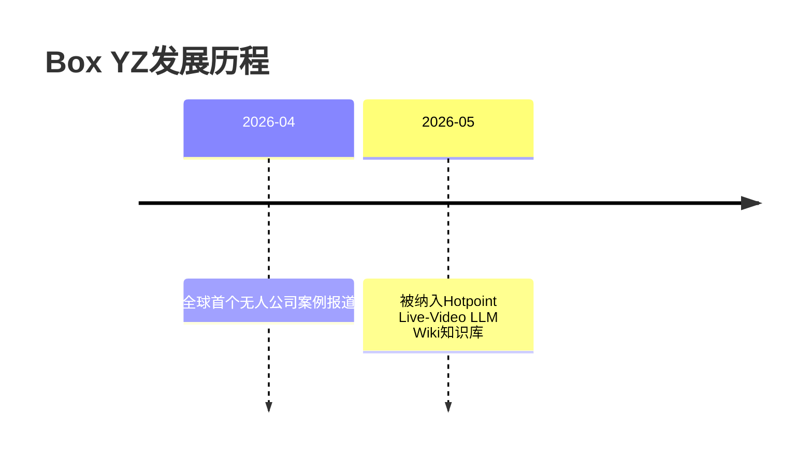

# Box YZ

## 概述

**Box YZ**是全球第一家完全由AI自主运营的无人公司，基于开源框架**欧风克拉**构建，实现24小时全自动化业务流程。该公司无需人类员工参与，通过6个AI Agent协作完成从市场调研、内容创作到广告发布及盈利活动的完整商业闭环。

## 关键属性

| 属性 | 值 |
|------|-----|
| 公司性质 | 全球首个完全AI自主运营的无人公司 |
| 技术基础 | 开源框架欧风克拉 |
| AI员工数量 | 6个（CEO、研究员、文案、设计、审核、发布） |
| 运营模式 | 24小时全自动化 |
| 人类参与 | 仅设计规则和SOP |
| 核心业务 | 数字资产贸易 |
| 边际成本 | 接近零 |
| 成立时间 | 2026年（报道时间） |

## 详细描述

### 核心定位

Box YZ不是简单的聊天工具，而是一个模拟"数字办公室"的复杂系统：
- **全流程自动化**：从决策到执行的完整业务闭环
- **无人干预运营**：人类仅需设计规则，系统自主运转
- **可规模化复制**：业务模式理论上可无限复制

### AI员工体系

Box YZ系统内置6个各司其职的AI角色，形成模拟人类公司的协作网络：

| AI角色 | 核心职责 | 工作方式 |
| :--- | :--- | :--- |
| **CEO** | 战略方向制定、任务分配 | 设定目标并下达至协作平台 |
| **研究员** | 市场信息收集与分析 | 在GitHub、Twitter等平台抓取热点数据 |
| **文案编辑** | 内容创作与优化 | 基于研究报告生成文案内容 |
| **设计师** | 视觉内容制作 | 配合文案完成设计工作 |
| **审核员** | 内容质量把控 | 检查内容合规性与质量 |
| **发布员** | 内容分发执行 | 直接登录后台完成发布、点赞等操作 |

### 技术突破

Box YZ实现全自动化运营的三大技术支柱：

#### 1. Computer Use集成技术
- **框架**：OpenCloud
- **功能**：AI对浏览器的直接操控，模拟人类点击、登录、上传等操作
- **意义**：突破AI仅能处理文字的局限，赋予"执行能力"

#### 2. Heartbeat定时触发系统
- **机制**：内置定时唤醒，周期性检查任务状态
- **特点**：无需人类指令，自主感知工作节奏
- **价值**：确保系统持续运转，实现"主动工作"模式

#### 3. Blackboard协作架构
- **核心**：基于共享黑板的任务流转机制
- **流程**：CEO在黑板发布任务→研究员抓取数据生成报告→文案/设计领取任务→发布员执行分发
- **优势**：多AI agent间无需人类中介即可实现复杂协作

### 盈利模式

**核心业务**：**数字资产贸易**

**业务闭环**：
1. **市场调研**：监控全球素材市场缺口
2. **产品生产**：自主生成高价值视觉素材、技术文档、趋势周报
3. **销售渠道**：自动上传至第三方交易平台
4. **盈利本质**：赚取信息差+自动化规模化收益

**核心优势**：
- 边际成本接近零
- 利润率极高
- 可24小时不间断运营
- 业务模式可无限复制

## 相关概念

- [[AI Agent]] - Box YZ的核心技术基础
- [[无人公司]] - Box YZ代表的新型商业模式
- [[数字资产]] - Box YZ的核心产品
- [[多Agent协作]] - Box YZ的协作架构
- [[Computer Use]] - 实现自动化的关键技术
- [[SOP]] - 标准作业程序，Box YZ的运营基础

## 相关实体

- [[欧风克拉]] - Box YZ基于的开源框架
- [[OpenCloud]] - 实现浏览器操控的技术框架

## 行业影响

### 商业逻辑变革
- 从"雇佣人力"转向"设计SOP"
- AI执行替代传统劳动力
- 竞争壁垒在于精细的流程设计和价值观定义

### 行业启示
- 展示了AI Agent技术在商业自动化领域的成熟应用
- 预示着"无人公司"时代的开端
- 为个人创业者提供了新的可能性

### 未来展望
- 可能催生更多无人公司案例
- 传统公司可能采用类似的AI Agent协作模式
- 将推动AI Agent开发工具和平台的普及

## 时间线

## 参考来源

1. [2026-04-29-全球首个无人公司Box-YZ运营模式](2026-04-29-全球首个无人公司Box-YZ运营模式.md)

---

> 此页面由LLM自动维护，最后更新于2026-05-08