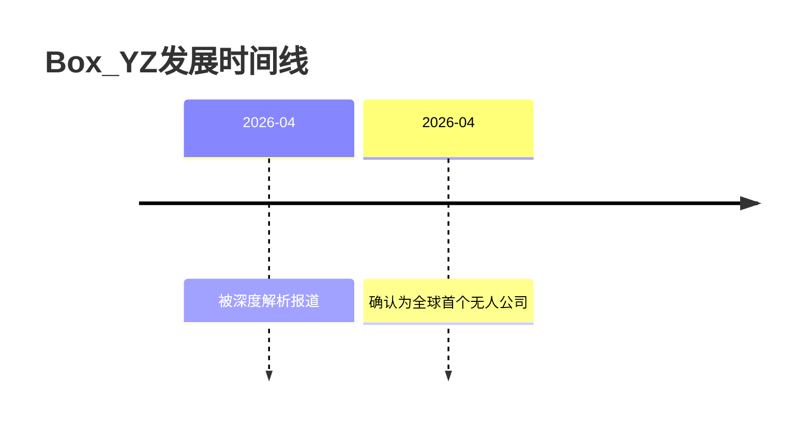

# Box_YZ

## 概述
> 全球第一家完全由AI自主运营的无人公司，基于开源框架构建，实现24小时全自动化业务流程。

## 关键属性

| 属性 | 值 |
|------|-----|
| 类型 | 公司（AI无人运营） |
| 所属领域 | AI自动化、数字资产贸易 |
| 核心特征 | 6个AI角色协作、24小时无人运营、数字资产贸易 |

## 详细描述

### 背景
Box YZ是基于开源框架"欧风克拉"构建的AI无人公司，模拟"数字办公室"的复杂系统，实现从决策到执行的完整业务闭环。

### 核心特点
- 非简单聊天工具，而是完整的业务自动化系统
- 6个AI角色各司其职：CEO、研究员、文案编辑、设计师、审核员、发布员
- 三大技术支柱：Computer Use集成、Heartbeat定时触发、Blackboard协作架构

### 市场定位
通过数字资产贸易盈利：监控全球素材市场缺口 -> 自主生成高价值视觉素材 -> 上传第三方交易平台。边际成本接近零，利润率极高。

## 相关概念

- [[无人公司运营模式]] - 核心商业模式
- [[AI Agent]] - 技术基础
- [[数字资产]] - 盈利模式

## 时间线

## 参考来源

1. [[2026-05-13-raw-全球首个无人公司Box_YZ]]

---
> 此页面由LLM自动维护，最后更新于2026-05-13
