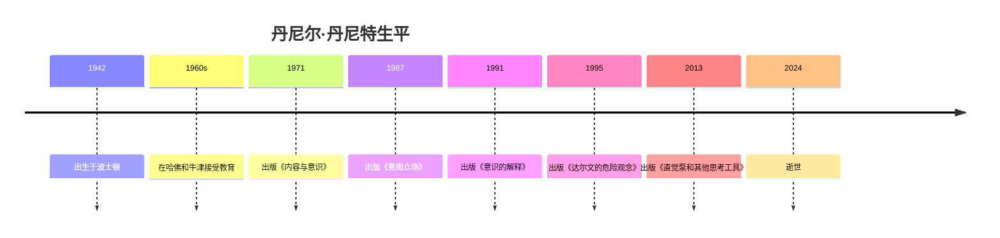

# 丹尼尔·丹尼特

## 概述

> 美国哲学家和认知科学家（1942-2024），塔夫茨大学教授，以对意识、自由意志和进化论的研究闻名，是当代最具影响力的哲学家之一。

## 关键属性

| 属性 | 值 |
|------|-----|
| 类型 | 人物/哲学家/认知科学家 |
| 生卒年 | 1942-2024 |
| 国籍 | 美国 |
| 所属领域 | 哲学、认知科学、进化论 |
| 核心贡献 | 意识的多元草稿理论、意向立场理论 |
| 代表作 | 《意识的解释》《直觉泵和其他思考工具》《达尔文的危险观念》 |

## 详细描述

### 背景

[[丹尼尔·丹尼特]] 1942年出生于美国波士顿，在哈佛大学和牛津大学接受教育。他在塔夫茨大学建立了认知研究中心，是该中心的联合创始主任。

### 核心特点
- 提出"意识的多元草稿理论"（Multiple Drafts Model），反对意识的"剧场"隐喻
- 提出意向立场理论，为理解心灵和人工智能提供了分析框架
- 坚决反对将意识问题神秘化，主张用进化论和认知科学解释心智
- 是"新无神论"运动的重要代表人物之一

### 学术影响
- 对心灵哲学、认知科学和人工智能哲学产生了深远影响
- 与理查德·道金斯等进化生物学家有密切学术交流
- 其思想在哲学和科学界引发了广泛讨论和争议

## 相关概念

- 直觉泵 - 其提出的思考工具概念
- [[思想实验]] - 其擅长使用的哲学方法
- 归谬法 - 其常用的论证方法
- 拉波波特法则 - 其推崇的讨论规则
- 史特金定律 - 其引用的思考工具
- 意向立场 - 其核心理论贡献
- 他者现象学 - 其讨论的哲学问题
- 意识的困难问题 - 其试图消解的哲学难题
- 自然选择作为算法过程 - 其进化论观点
- 自由意志 - 其重要研究领域
- 进化论 - 其理论基础
- 认知科学 - 其跨学科领域

## 相关实体

- 蒯因 - 学术导师和影响者
- [[吉尔伯特·赖尔]] - 学术影响者
- 理查德·道金斯 - 学术合作者
- [[萨姆·哈里斯]] - 新无神论运动同侪
- [[克里斯托弗·希钦斯]] - 新无神论运动同侪
- 马文·明斯基 - AI研究同侪
- 陈嘉映 - 中国推荐者
- [[汪丁丁]] - 中国推荐者
- [[傅小兰]] - 中国推荐者
- [[周晓林]] - 中国推荐者

## 时间线

## 参考来源

1. 《直觉泵和其他思考工具》，丹尼尔·丹尼特著

---

> 此页面由LLM自动维护，最后更新于2026-05-22
