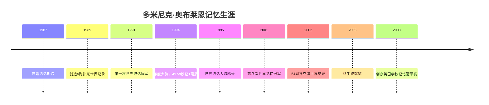

# 多米尼克·奥布莱恩

## 概述
> 8次世界记忆冠军，世界首席记忆大师，多米尼克记忆系统创始人。

## 关键属性

| 属性 | 值 |
|------|-----|
| 类型 | 人物 |
| 英文名 | Dominic O'Brien |
| 国籍 | 英国 |
| 主要成就 | 8次世界记忆冠军 |
| 代表作品 | 《我最想要的记忆魔法书》 |
| 荣誉 | 年度大脑(1994)、终生成就奖(2005) |

## 详细描述

### 背景
童年被判定有阅读障碍症，老师认为他"这辈子不会有什么出息"。1987年开始记忆训练，最初用26分钟记住1副扑克牌，此后不断突破世界纪录。

### 核心成就
- 1991-2001年间获得8次世界记忆冠军
- 1994年创造43.59秒记住1副扑克牌的世界纪录
- 2002年创造记住54副扑克牌的世界纪录
- 2005年获终生成就奖
- 2008年创办英国学校记忆冠军赛
- 2010年任世界记忆运动委员会总裁

## 相关概念

- [[多米尼克记忆系统]]
- [[路径记忆法]]
- [[扑克牌记忆术]]
- [[数字记忆编码]]

## 相关实体

- [[东尼·博赞]] - 思维导图创始人，对其高度评价

## 时间线

## 参考来源

1. 《我最想要的记忆魔法书》- 多米尼克·奥布莱恩著

---
> 此页面由LLM自动维护，最后更新于2026-05-23
