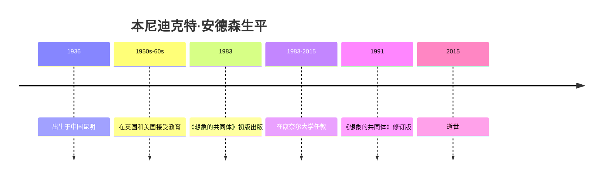

# 本尼迪克特·安德森

## 概述

> 美国政治学家与历史学家（1936-2015），以《想象的共同体》闻名于世，提出了民族是"想象的共同体"的经典理论。

## 关键属性

| 属性 | 值 |
|------|-----|
| 类型 | 人物/政治学家 |
| 生卒年 | 1936-2015 |
| 国籍 | 爱尔兰/美国/英国 |
| 所属领域 | 政治学、历史学、东南亚研究 |
| 核心贡献 | 民族主义理论 |
| 代表作 | 《想象的共同体》 |

## 详细描述

### 背景

[[本尼迪克特·安德森]] 1936年出生于中国昆明，在爱尔兰、英国和美国接受教育。他在康奈尔大学长期任教，是东南亚研究领域的权威学者。他的弟弟是历史学家佩里·安德森。

### 核心特点
- 提出"想象的共同体"理论，重新定义了民族主义的本质
- 强调印刷资本主义在民族形成中的关键作用
- 关注语言、技术和资本主义之间的互动关系
- 研究范围涵盖东南亚、拉丁美洲等多个地区

### 学术影响
- 《想象的共同体》是民族主义研究领域的经典著作
- 其理论被广泛应用于政治学、历史学、社会学等领域
- 对[[殖民主义]]和[[帝国主义]]研究产生了深远影响

## 相关概念

- [[想象的共同体]] - 其核心理论贡献
- 民族主义 - 核心研究对象
- 印刷资本主义 - 民族意识起源的技术基础
- [[民族意识的起源]] - 民族认同形成的历史过程
- [[官方民族主义]] - 自上而下的民族政策
- [[欧裔海外移民先驱者]] - 跨大西洋民族意识
- [[最后一波]] - 二战后民族主义浪潮
- [[帝国主义]] - 与民族主义互动的体系
- [[殖民主义]] - 民族主义兴起的历史背景

## 相关实体

- [[吴叡人]] - 中译本译者
- [[汪晖]] - 推荐者/评注者
- [[沃尔特·本雅明]] - 相关思想家
- 丹尼尔·笛福 - 相关文学家

## 时间线

## 参考来源

1. 《想象的共同体》，本尼迪克特·安德森著，吴叡人译

---

> 此页面由LLM自动维护，最后更新于2026-05-22
