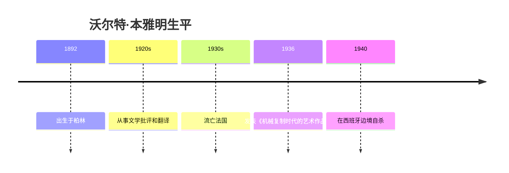

# 沃尔特·本雅明

## 概述

> 德国哲学家、文学批评家和文化理论家（1892-1940），其关于机械复制时代的艺术理论和历史哲学对20世纪人文学科产生了深远影响。

## 关键属性

| 属性 | 值 |
|------|-----|
| 类型 | 人物/哲学家/批评家 |
| 生卒年 | 1892-1940 |
| 国籍 | 德国 |
| 所属领域 | 哲学、文学批评、文化理论 |
| 核心贡献 | 艺术复制理论、历史哲学 |
| 代表作 | 《机械复制时代的艺术作品》《历史哲学论纲》 |

## 详细描述

### 背景

[[沃尔特·本雅明]] 1892年出生于柏林的一个犹太家庭。他是法兰克福学派的重要关联人物，与阿多诺、肖勒姆等人有密切交往。1940年在试图逃离纳粹迫害时于西班牙边境自杀。

### 核心特点
- 提出"灵韵"（Aura）概念，分析机械复制对艺术的影响
- 其历史哲学强调从被征服者的视角书写历史
- 关注技术变革对社会和文化的影响（与印刷资本主义理论相关）
- 融合了马克思主义、犹太神秘主义和德国浪漫主义传统

### 学术影响
- 对文化研究、媒介研究和批判理论产生了深远影响
- 其思想与[[本尼迪克特·安德森]]关于印刷技术与民族意识的理论有相通之处

## 相关概念

- 印刷资本主义 - 技术与文化的关系
- [[想象的共同体]] - 媒介与集体认同
- 解构主义 - 相关哲学传统
- 符号学 - 相关理论方法

## 相关实体

- [[本尼迪克特·安德森]] - 受其思想影响
- 雅克·德里达 - 受其思想影响

## 时间线

## 参考来源

1. 《想象的共同体》，本尼迪克特·安德森著
2. 《机械复制时代的艺术作品》，沃尔特·本雅明著

---

> 此页面由LLM自动维护，最后更新于2026-05-22
