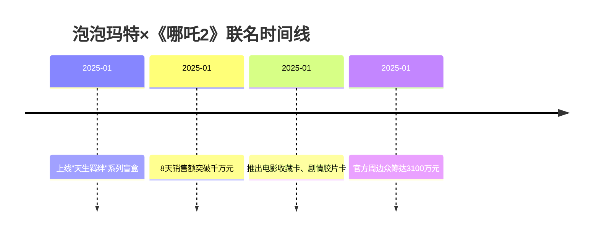

# 泡泡玛特

## 概述

**泡泡玛特**是中国领先的潮流玩具品牌，以盲盒产品闻名。在IP联名领域，泡泡玛特展示了"IP联名产品化"的最佳实践，通过与《哪吒2》等热门IP合作，实现了从短期营销到长期产品运营的转型。

## 关键属性

| 属性 | 值 |
|------|-----|
| 公司性质 | 潮流玩具品牌 |
| 核心产品 | 盲盒、手办、潮玩周边 |
| 行业地位 | 中国潮玩行业领导者 |
| 商业模式 | IP运营+产品销售 |
| 核心能力 | IP联名产品化、潮玩设计、粉丝运营 |

## 详细描述

### IP联名产品化策略

泡泡玛特在IP联名领域展示了"产品化思维"的最佳实践：

**核心特征**：
- 不满足于简单的"IP换皮"
- 通过产品设计放大IP的故事性
- 将短期热点转化为可持续的商业价值
- 不仅"卖"IP，更是在"做"IP

### 《哪吒2》联名案例

**产品策略**：
- "天生羁绊"系列盲盒：以"羁绊"为主题，将哪吒和敖丙的经典形象进行系列化表达
- 电影收藏卡、剧情胶片卡：满足电影粉丝的收藏需求
- 强化品牌的潮玩定位

**业绩数据**：
| 指标 | 数值 |
|------|------|
| 盲盒8天销售额 | 千万元+ |
| 每天搜索人数 | 2万+ |
| 天猫旗舰店预售 | 排到6月底 |
| 收藏卡一周销量 | 70万张 |
| 官方周边众筹金额 | 3100万元（目标的310倍） |

### 商业模式

**IP运营能力**：
- 将IP热度转化为可持续的产品销售
- 建立粉丝收藏生态
- 形成IP衍生品矩阵

**产品创新**：
- 盲盒、手办、卡牌等多元产品形态
- 故事性设计与产品功能结合
- 满足粉丝的收藏和社交需求

## 相关概念

- [[IP联名]] - 泡泡玛特的核心商业策略
- [[品牌联名]] - 品牌间合作营销
- [[产品化]] - IP联名的产品思维
- [[价值共生]] - IP联名的核心理念

## 相关实体

- [[哪吒2]] - 2025年现象级IP联名案例
- [[库迪咖啡]] - 同期IP联名品牌
- [[霸王茶姬]] - 同期IP联名品牌

## 行业影响

### IP联名模式创新
- 展示了IP联名产品化的最佳实践
- 证明了IP联名的长期商业价值
- 为潮玩行业树立了标杆

### 商业价值验证
- 《哪吒2》相关周边销售额超过3亿元
- 潮玩类商品成交超过2亿元
- 验证了IP联名的产品化路径

## 时间线

## 参考来源

1. [2025-品牌IP联名跨界逻辑变了](2025-品牌IP联名跨界逻辑变了.md)

---

> 此页面由LLM自动维护，最后更新于2026-05-08