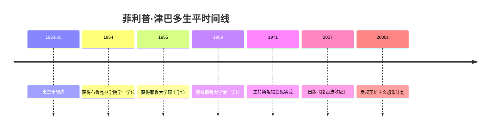

# 菲利普·津巴多

## 概述
> 菲利普·乔治·津巴多（Philip George Zimbardo, 1933-），美国心理学家，以主持著名的"斯坦福监狱实验"而闻名于世，是当代最具影响力的[[社会心理学]]家之一。

## 关键属性

| 属性 | 值 |
|------|-----|
| 类型 | 人物/心理学家 |
| 所属领域 | 心理学/社会心理学 |
| 出生 | 1933年3月23日，纽约 |
| 国籍 | 美国 |
| 学派 | 社会心理学 |
| 核心贡献 | 斯坦福监狱实验、时间心理学、态度改变与社会影响 |
| 代表著作 | 《态度改变与社会影响》《路西法效应》《津巴多普通心理学》 |
| 学术机构 | 斯坦福大学、耶鲁大学 |

## 详细描述

### 背景
津巴多于1933年出生于纽约的一个意大利裔家庭。他在布鲁克林学院获得学士学位，在耶鲁大学获得硕士和博士学位。他曾先后在耶鲁大学、纽约大学和斯坦福大学任教。

### 核心特点
- **斯坦福监狱实验（1971）**：模拟监狱环境中的权力关系，揭示了情境力量对人类行为的强大影响。该实验成为社会心理学史上最著名（也最具争议）的实验之一。
- **路西法效应**：在《路西法效应》中，津巴多探讨了好人如何在特定情境下做出恶行，强调情境力量胜过个人品质。
- **时间心理学**：开创了时间视角（时间洞察力）研究，探讨个体对过去、现在和未来的不同取向如何影响行为和决策。
- **态度改变与社会影响**：与迈克尔·利佩合著，系统阐述了社会影响的各种形式和机制。
- **英雄主义计划**：晚年发起"英雄主义想象计划"，研究普通人如何在困难情境中做出英雄行为。

### 学术影响
津巴多的研究对心理学、社会学、法学、伦理学等多个领域产生了深远影响。斯坦福监狱实验引发了对研究伦理的广泛讨论，推动了心理学研究伦理规范的建立。

## 相关概念

- [[社会影响]] - 津巴多的核心研究领域
- [[态度改变]] - 津巴多研究的核心议题
- [[服从心理]] - 斯坦福监狱实验涉及的核心概念
- 从众 - 社会影响的形式之一
- [[社会心理学]] - 津巴多所属的心理学分支
- [[心理学经典著作]] - 津巴多的著作

## 相关实体

- [[迈克尔·利佩]] - 《态度改变与社会影响》的合著者
- [[弗洛伊德]] - 心理学史上的重要人物
- [[班杜拉]] - 社会学习理论创始人

## 时间线

## 参考来源

1. Zimbardo, P. G., & Leippe, M. R. (2007). *The Psychology of Attitude Change and Social Influence*. 人民邮电出版社.
2. [[态度改变与社会影响]] - 中文版来源

---

> 此页面由LLM自动维护，最后更新于2026-05-22
