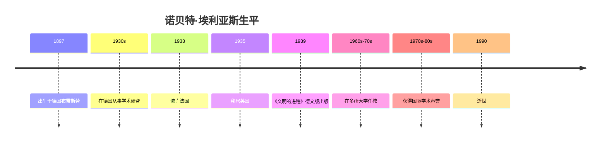

# 诺贝特·埃利亚斯

## 概述

> 德国社会学家（1897-1990），以《文明的进程》闻名于世，提出了社会发生与心理发生相互依存的理论框架。

## 关键属性

| 属性 | 值 |
|------|-----|
| 类型 | 人物/社会学家 |
| 生卒年 | 1897-1990 |
| 国籍 | 德国/英国 |
| 所属领域 | 社会学、历史学 |
| 核心贡献 | 过程社会学、文明理论 |
| 代表作 | 《文明的进程》 |

## 详细描述

### 背景

[[诺贝特·埃利亚斯]] 1897年出生于德国布雷斯劳（今波兰弗罗茨瓦夫）的一个犹太家庭。他在德国接受教育，1933年纳粹上台后流亡法国，后定居英国。他在曼彻斯特大学等机构任教，但直到晚年才获得学术界的广泛认可。

### 核心特点
- 提出"过程社会学"（Figurational Sociology），反对静态的社会分析
- 强调社会发生与心理发生的不可分割性
- 认为"文明"是一个长期的历史过程而非静态状态
- 关注宫廷社会、国王机制等中世纪晚期到近代欧洲的社会转型

### 学术影响
- 晚年获得广泛的国际学术声誉
- 对社会学、历史学、[[心理学史]]产生了深远影响
- 其理论框架被用于分析各种文明化进程

## 相关概念

- 文明进程 - 其核心理论贡献
- 社会发生 - 社会结构变迁的分析框架
- 心理发生 - 心理结构变迁的分析框架
- 自我强制 - 文明化的内在机制
- 外部强制 - 文明化的外在机制
- 情感控制结构 - 情感规范化的理论
- 羞耻感界限前移 - 文明化的情感维度
- 相互依存 - 社会分工的基础
- 垄断的社会化 - 国家形成理论
- 国王机制 - 权力平衡理论
- 宫廷社会 - 文明化的社会舞台
- 行为规范 - 社会约束的形式

## 相关实体

- [[高茨洛姆]] - 推荐者/评注者

## 时间线

## 参考来源

1. 《文明的进程》，诺贝特·埃利亚斯著，王佩莉、袁志英译

---

> 此页面由LLM自动维护，最后更新于2026-05-22
