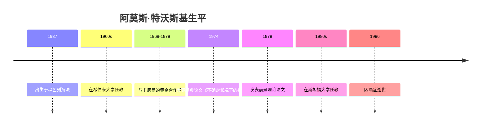

# 阿莫斯·特沃斯基

## 概述

> 以色列裔美国心理学家和数学家（1937-1996），与[[丹尼尔·卡尼曼]]共同开创了认知偏差和启发式研究，是[[行为经济学]]的奠基人之一。

## 关键属性

| 属性 | 值 |
|------|-----|
| 类型 | 人物/心理学家/数学家 |
| 生卒年 | 1937-1996 |
| 国籍 | 以色列/美国 |
| 所属领域 | 认知心理学、行为经济学、数学心理学 |
| 核心贡献 | 启发式与认知偏差理论、前景理论 |
| 代表作 | 《不确定状况下的判断》（与卡尼曼合著） |

## 详细描述

### 背景

[[阿莫斯·特沃斯基]] 1937年出生于以色列海法，在希伯来大学和密歇根大学接受教育。他在斯坦福大学长期任教，是20世纪最有影响力的心理学家之一。

### 核心特点
- 与[[丹尼尔·卡尼曼]]的合作是20世纪社会科学最伟大的智力合作
- 发现了[[代表性启发]]、[[可得性启发]]、[[锚定效应]]等核心认知偏差
- 共同提出前景理论，揭示了风险决策的非理性模式
- 以严谨的数学方法研究人类判断和决策
- 1996年因癌症英年早逝

### 学术影响
- 其与卡尼曼的研究彻底改变了经济学、心理学和决策科学
- [[行为经济学]]和[[行为金融学]]的建立直接基于其研究成果
- 2002年卡尼曼因两人共同的研究获得诺贝尔经济学奖（特沃斯基因已去世而无法获奖）

## 相关概念

- [[行为经济学]] - 其奠基的学科领域
- [[启发式]] - 其发现的核心概念
- [[代表性启发]] - 其发现的主要启发式
- [[可得性启发]] - 其发现的主要启发式
- [[锚定效应]] - 其发现的主要偏差
- [[认知偏差]] - 其系统性研究的主题
- 前景理论 - 其与卡尼曼共同提出的理论
- [[决策与判断]] - 其核心研究领域
- [[专家判断vs统计模型]] - 其研究支持的观点
- [[有限理性]] - 理论基础

## 相关实体

- [[丹尼尔·卡尼曼]] - 学术合作伙伴
- [[迈克尔·刘易斯]] - 《思维的发现》作者
- [[理查德·塞勒]] - 学术继承者

## 时间线

## 参考来源

1. 《思维的发现》，迈克尔·刘易斯著

---

> 此页面由LLM自动维护，最后更新于2026-05-22
