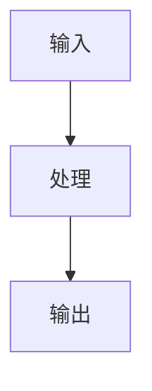

# 概念名称

## 定义
> 清晰简洁地定义这个概念。

## 核心原理

### 基本原理
描述概念的基本工作原理。

### 关键要素
- 要素1：描述
- 要素2：描述
- 要素3：描述

## 技术架构

## 应用场景

### 场景1：场景名称
描述具体的应用场景和使用方式。

### 场景2：场景名称
描述具体的应用场景和使用方式。

## 优势与局限

### 优势
- ✅ 优势1
- ✅ 优势2
- ✅ 优势3

### 局限
- ⚠️ 局限1
- ⚠️ 局限2

## 相关实体

- 实体1
- 实体2

## 相关概念

- 概念1
- 概念2

## 发展趋势

### 当前状态
描述概念的当前发展状态。

### 未来展望
描述概念的未来发展方向。

## 参考来源

1. 来源1
2. 来源2

---

> 此页面由LLM自动维护，最后更新于YYYY-MM-DD
