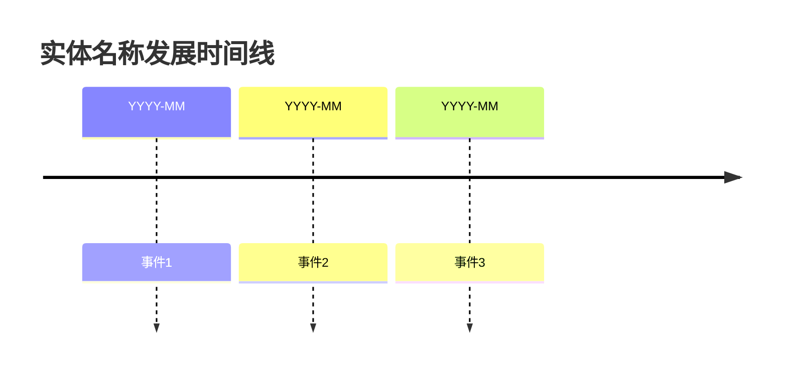

# 实体名称

## 概述
> 一句话描述这个实体是什么。

## 关键属性

| 属性 | 值 |
|------|-----|
| 类型 | 公司/产品/人物/平台 |
| 所属领域 | |
| 成立时间 | |
| 规模 | |
| 关键特征 | |

## 详细描述

### 背景
描述实体的背景信息、发展历程。

### 核心特点
- 特点1
- 特点2
- 特点3

### 市场定位
描述实体的市场定位和竞争优势。

## 相关概念

- [[概念1]]
- [[概念2]]

## 相关实体

- [[实体1]]
- [[实体2]]

## 时间线

## 关键数据

| 指标 | 数值 | 时间 |
|------|------|------|
| | | |

## 参考来源

1. 来源1
2. 来源2

---

> 此页面由LLM自动维护，最后更新于YYYY-MM-DD