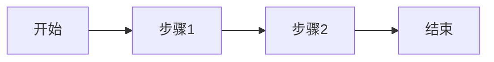

# 演示文稿标题

副标题或描述

---

## 目录

1. 第一部分
2. 第二部分
3. 第三部分

---

## 第一部分：部分标题

### 要点1
- 内容1
- 内容2

### 要点2
- 内容1
- 内容2

---

## 数据展示

| 指标 | 数值 |
|------|------|
| 指标1 | 数值1 |
| 指标2 | 数值2 |

---

## 流程图

---

## 第二部分：部分标题

### 核心观点
> 重要观点引用

### 详细说明
详细说明内容。

---

## 第三部分：总结

### 关键要点
1. 要点1
2. 要点2
3. 要点3

### 下一步行动
- 行动1
- 行动2

---

## 谢谢

联系方式或补充信息

---

> 此演示文稿由LLM基于Wiki内容生成
> 关联Wiki页面：相关页面1, 相关页面2
