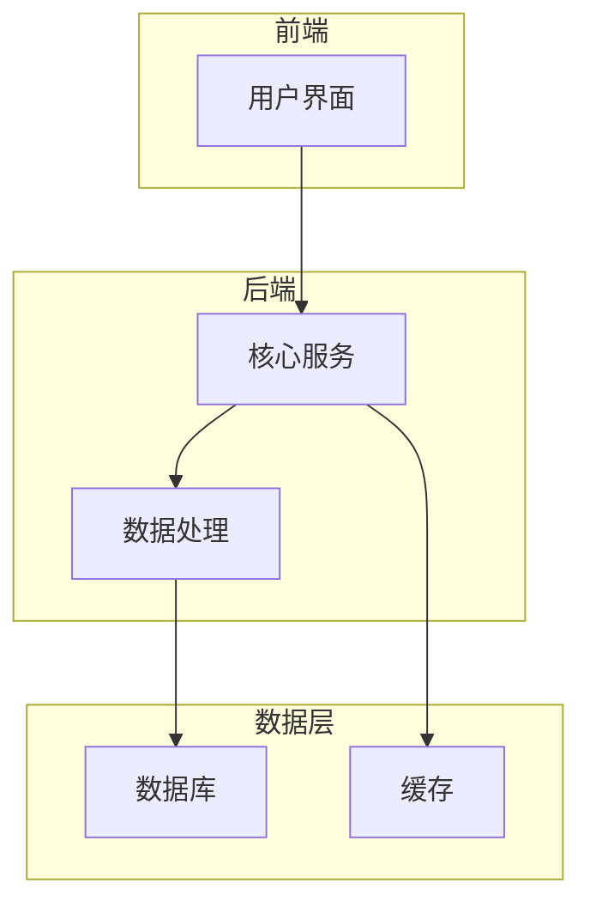

# 产品名称 - 概念

## 产品概述

> 一句话描述这个概念产品是什么，解决什么问题。

## 灵感来源

### 触发热点
描述触发这个产品概念的原始热点或洞察。

### 相关来源
- 来源1
- 来源2

## 目标用户

### 主要用户群
| 用户画像 | 特征 | 痛点 |
|----------|------|------|
| 用户群1 | | |
| 用户群2 | | |

### 用户场景
描述用户在什么场景下会使用这个产品。

## 核心功能

### 功能1：功能名称
**描述**：详细描述这个功能。
**价值**：这个功能为用户带来的价值。

### 功能2：功能名称
**描述**：详细描述这个功能。
**价值**：这个功能为用户带来的价值。

### 功能3：功能名称
**描述**：详细描述这个功能。
**价值**：这个功能为用户带来的价值。

## 产品架构

## 市场定位

### 竞品分析
| 竞品 | 优势 | 劣势 | 差异化 |
|------|------|------|--------|
| 竞品1 | | | |
| 竞品2 | | | |

### 差异化优势
- 差异化1
- 差异化2

## 商业模式

### 收入模式
描述产品的收入模式。

### 定价策略
描述产品的定价策略。

## 实现路径

### MVP阶段
- [ ] 功能1
- [ ] 功能2
- [ ] 功能3

### 成长阶段
- [ ] 功能4
- [ ] 功能5

### 成熟阶段
- [ ] 功能6
- [ ] 功能7

## 风险评估

| 风险 | 可能性 | 影响 | 应对策略 |
|------|--------|------|----------|
| 风险1 | | | |
| 风险2 | | | |

## 演示文稿

- 产品名称-演示

## 相关实体

- 实体1
- 实体2

## 相关概念

- 概念1
- 概念2

---

> 此页面由LLM自动维护，最后更新于YYYY-MM-DD
